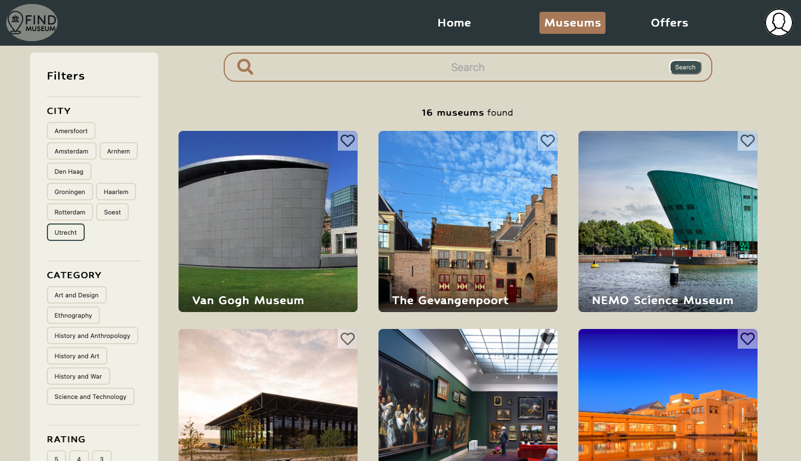
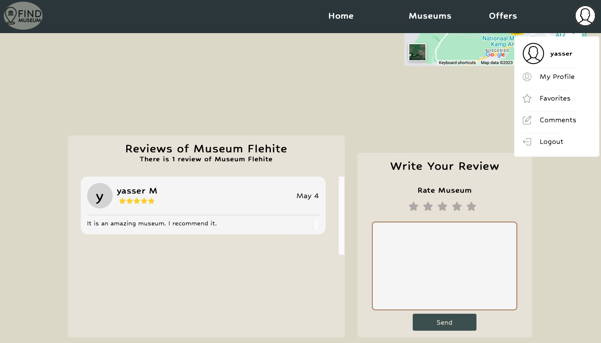
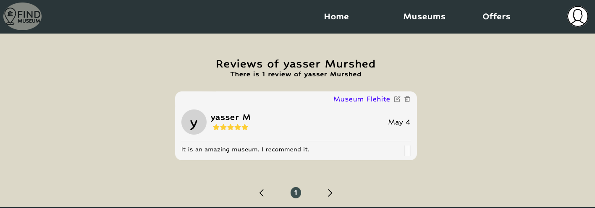
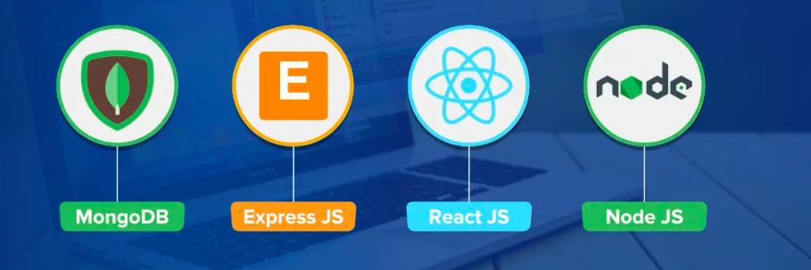
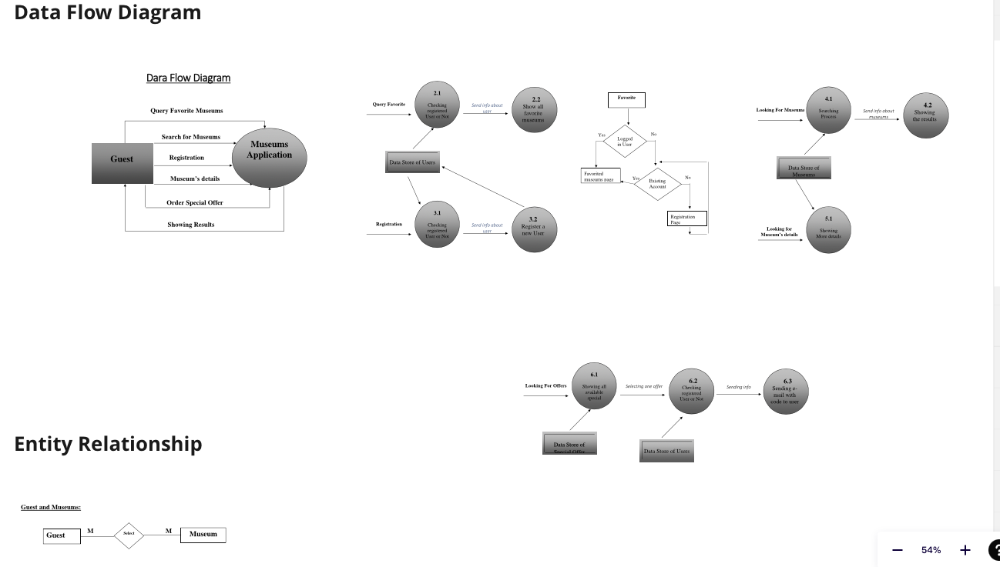

# The final project at HackYourFuture program

**_Find Museum_** is an application aiming to provide information of museums in the Netherlands. It presents also a coming events in the museums\. In addition, the application's visitor can get special offers to visit museums, follow upcoming events, read museum reviews, share their experiences, and add a list of their favorite museums. The application provides a variety of filter options to find museums including searching by name, category, city, rate, and price. It can be also a group of filtering, for example, searching by city, category, and price.

**_Features of Application_**

1. Creating users with all fields validation using useFormik and Yup library.
2. Ability to modify the user profile, information, and reset the password if forgotten.
3. Searching for museum with different filters including name, city, type, price, and rate.
4. Adding or removing list of favorite museums.
5. Adding, editing and deleting reviews.
6. Getting special offers for visiting museum sent to your email; making sure that only one offer for each user to a selected museum.
7. Showing a details page which contains important information about museum including opening hours, price, number of users liking this museum, address, and short information.
8. Showing top rated museums in Amsterdam city.
9. Showing upcoming events in some museums.

[Click here for the Demo version](https://vimeo.com/828049139?share=copy) {: .shadow}

{: .shadow}
{: .shadow}

 {: .shadow}



## Technologies used:

### <i class="fab fa-gitlab fa-fw" style="color:rgb(107,79,187); font-size:.85em" aria-hidden="true"></i> Using MERN stack (MongoDB, Express, React, Node)



### <i class="fab fa-gitlab fa-fw" style="color:rgb(107,79,187); font-size:.85em" aria-hidden="true"></i> Following the agile methodology with a team and a group of mentors.


### <i class="fab fa-gitlab fa-fw" style="color:rgb(107,79,187); font-size:.85em" aria-hidden="true"></i> Using Data Flow Diagram.



## 1. Setup

First, to setup all the directories run the following in the main directory:

`npm install`

`npm run setup`

The first command will install `cypress` and some small libraries needed for running the rest of the commands. The second will go into the `client` and `server` directories and set those up to be ran.

In the `client` and `server` directory there are two `.env.example` files. Create a copy and rename that to `.env`. Then follow the instructions in those files to fill in the right values.

To run the app in dev mode you can run the following command in the main directory:

`npm run dev`

## 2. Code structure

```
client
├── public
└── src
|   └── __tests__
|   └── __testUtils__
|   └── assets
|   └── components
|   └── context
|   └── hooks
|   └── pages
|       └── __tests__
|       └── components
|   └── util
|   index.jsx
cypress
|   └── fixtures
|   └── integration
|   └── plugins
|   └── support
server
└── src
    └── __tests__
    └── __testUtils__
    └── controllers
    └── db
    └── models
    └── routes
    └── util
    index.js
```

### 2.1 Client structure

- `public` || public facing client code
- `__tests__` || any `jest` tests for specific components will be in a `__tests__` folder on the same level
- `__testUtils__` || any code that is only being used in the tests is put in the `__testUtils__` folder to separate that away from the rest of the code
- `components` || all of our shared components that are used over multiple pages
- `components` || containing three files providing a way to pass data through the component tree without having to pass props down manually at every level.
- `hooks` || all of our custom hooks
- `pages` || the page components of our app, any routing will go between these components
- `pages/components` || components used specifically on those pages
- `util` || any utility functions that can be used anywhere on the client side
- `index.jsx` || the start point of the client

### 2.2 Cypress structure

- `fixtures` || any data/files that `cypress` needs can be placed here
- `integration` || all of our tests are in here, separated in folders based on the pages in our app
- `plugins` || any plugins for our `cypress` configuration can be placed here
- `support` || custom commands and other support files for `cypress` can be placed here

### 2.3 Server structure

- `__tests__` || any `jest` tests for the api endpoints as that is our testing strategy for the backend
- `__testUtils__` || any code that is only being used in the tests is put in the `__testUtils__` folder to separate that away from the rest of the code
- `controllers` || all of our controller functions that interact with the database
- `db` || all of our configuration for the database
- `models` || all of our `mongoose` models will be placed here
- `routes` || code to match up the API with our controllers
- `util` || any utility functions that can be used anywhere on the server side
- `index.js` || the start point of the server

## 3. Stack / external libraries

The base stack of the app is a MERN stack (Mongoose, Express, React, Node). Next to that we make use of the following extras:

### 3.1 Configuration libraries

- `dotenv` || To load the .env variables into the process environment. See [docs](https://www.npmjs.com/package/dotenv)
- `webpack` / `html-webpack-plugin` || To bundle our React app and create a static app to host. See [docs](https://webpack.js.org/)
- `husky` || To run our tests and linter before committing. See [docs](https://typicode.github.io/husky/#/)
- `eslint` || To check our code. We have different configurations for frontend and backend. You can check out the configuration in the `.eslintrc.(c)js` files in the respective `client` and `server` folders. See [docs](https://eslint.org/)
- `prettier` || To automatically format our code. See [docs](https://prettier.io/)
- `concurrently` || To run commands in parallel. See [docs](https://github.com/open-cli-tools/concurrently#readme)

For more information on how these work together including the automatic deployment to heroku, have a look at our detailed [DEV](./DEV.md) file.

### 3.2 Client-side libraries

- `@testing-library/*` || We use React Testing Library to write all of our tests. See [docs](https://testing-library.com/docs/react-testing-library/intro/)
- `jest` || To run our tests and coverage. See [docs](https://jestjs.io/)
- `jest-fetch-mock` || To mock out the backend for our testing purposes. See [docs](https://github.com/jefflau/jest-fetch-mock#readme)
- `prop-types` || To type-check our components. See [docs](https://github.com/facebook/prop-types)

### 3.3 Server-side libraries

- `nodemon` || To automatically restart the server when in development mode. See [docs](https://nodemon.io/)
- `jest` || To run our tests and coverage. See [docs](https://jestjs.io/)
- `supertest` || To more easily test our endpoints. See [docs](https://github.com/visionmedia/supertest#readme)
- `mongodb-memory-server` || To mock out our database in our backend tests. See [docs](https://github.com/nodkz/mongodb-memory-server)
- `cors` || To open up our API. See [docs](https://github.com/expressjs/cors#readme)
- `mongoose` || To add schemas to our database. See [docs](https://mongoosejs.com/)
